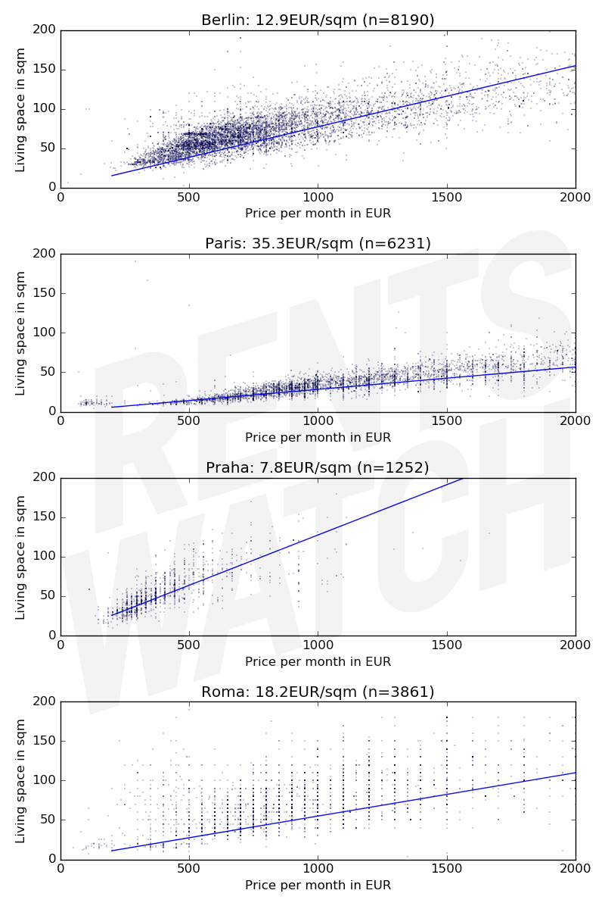

In the first few weeks of Rentswatch, we collected about 375,000 data points on rentals in Europe.

The graphs below show rent prices in Berlin, Paris, Prague and Rome. Each dot represents one ad for a flat, published in the past few months. The rent is on the horizontal axis and the living area of the flat is on the vertical axis. The blue line shows the trend.

Flats below the blue line are cheaper than predicted, prices above are more expensive. [The source code to the analysis is available on Github](https://github.com/jplusplus/rentswatch-stats).

### Housing statistics

The price per square meter we show is actually the slope of the trend line. In Rome, for each additional square meter on the vertical axis, the blue line goes 18 euros to the right. This statistical model predicts that paying 1,000€ will give you the keys to a 55 square-meter flat. This is not the same as the average price per square meter. In Rome, the average price is much cheaper: 14€/sqm. The discrepancy arises because many flats in Rome are rented for less than 18€/sqm, especially very large ones.

Statistically speaking, the relation between what you pay and how big your flat is is very strong. But you see that the data can vary widely. 500€ a month in Berlin can get you anything between a 27-sqm room in the city center (Schöneberg) and a 4-room penthouse close to the easternmost city limit (Hellersdorf). Using a single measure to assess the housing situation is probably not a good idea.

Using administrative boundaries is also limiting. Prices are more concentrated in Paris because the city is small. The city is squeezed within 105 square km when Prague spreads over 500 km², 900 for Berlin and a whopping 1300 for Rome. In other words, we should compare Paris within city limits to the core center of the others. We will provide new analyses based on actual (and not administrative) geography soon.

### Biases

The data we show isn't representative of the whole housing situation. Many people own their flats. Others stay at parents' or friends'. The whole subsidized housing sector does not appear. 

More importantly, many transactions happen off-radar. In Berlin, new regulations forbade realtors from charging a brokerage commission to tenants. As a result, realtors set up new services, whereby would-be tenants can pay them for help in their housing search. In other words, adverts for the best flats are taken out of the open market and shown only to prospective renters who can afford to pay for special services.

Technically, our data is not clean yet. Some data points might be bogus, such as the small cloud on the bottom left of the Paris chart. We will continue to refine our data to provide the best information possible on rents in Europe.

## Want to see the data for your city?

Rentswatch aims at fostering quality journalism on the housing crisis. We are looking for exclusive media partners in Europe to explore the data with us. Contact us at contact@rentswatch.com