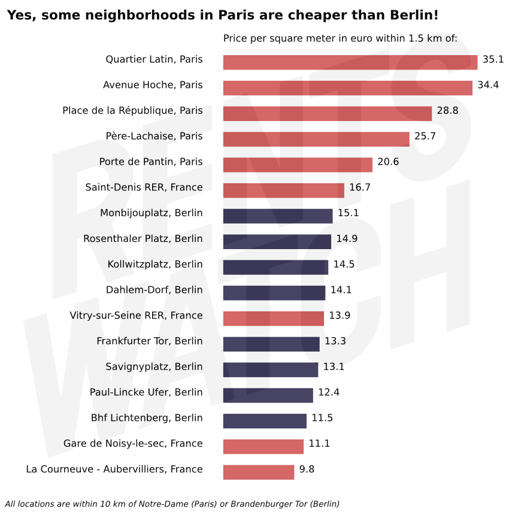

Rental prices per city mostly tell you about the administrative boundaries. The area of Paris proper is only twice as big as the very central district of Berlin-Mitte. Comparing Paris and Berlin within city limits makes no sense.

Comparing cities makes even less sense because individuals rarely look for flats in the entire area of the city. They search within a particular neighborhood, or, at the very least, along a line of public transit.

That's why we harvest data at the micro level. We looked at prices in Berlin and Paris for 17 neighborhoods. We analyzed data points within 1.5 km (a 20-minute walk) of the given location, usually a subway station. All neighborhoods are within 10 walking kilometers of either Notre-Dame (Paris) or Brandenburger Tor (Berlin).

[The detailed results can be found here.](https://github.com/jplusplus/rentswatch-stats/blob/master/analyses/city_circles/table.csv)

Some neighborhoods in Paris are much cheaper than the cheapest ones in Berlin. (To find cheaper rents in Berlin, one would have to go to Marzahn, 12 kilometers from the city center.) This shows how segregated Paris is. In contrast, housing prices in Berlin are densely concentrated around the average value.

The intra-city housing situation can be more unequal than any European divide. We will use our data to compile rankings of housing inequality for European cities.

### Biases

It could be that our data is wrong in a variety of ways. For starters, data points in Paris are aggregated every 500 meters or so, making it impossible to do a finer analysis. In some neighborhoods, data is too sparse to come to a conclusion (Saint-Denis only has 5 data points). In others, inequalities abound within the 1.5 km radius we chose. Paul-Lincke Ufer in Berlin combines within walking distance renovated lofts with view on the canal and derelict buildings.

## Want to see the data for your city?

Rentswatch aims at fostering quality journalism on the housing crisis. We are looking for exclusive media partners in Europe to explore the data with us. Contact us at contact@rentswatch.com 