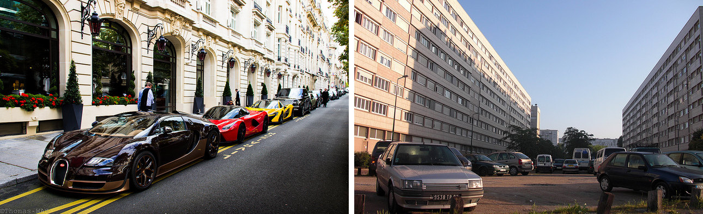
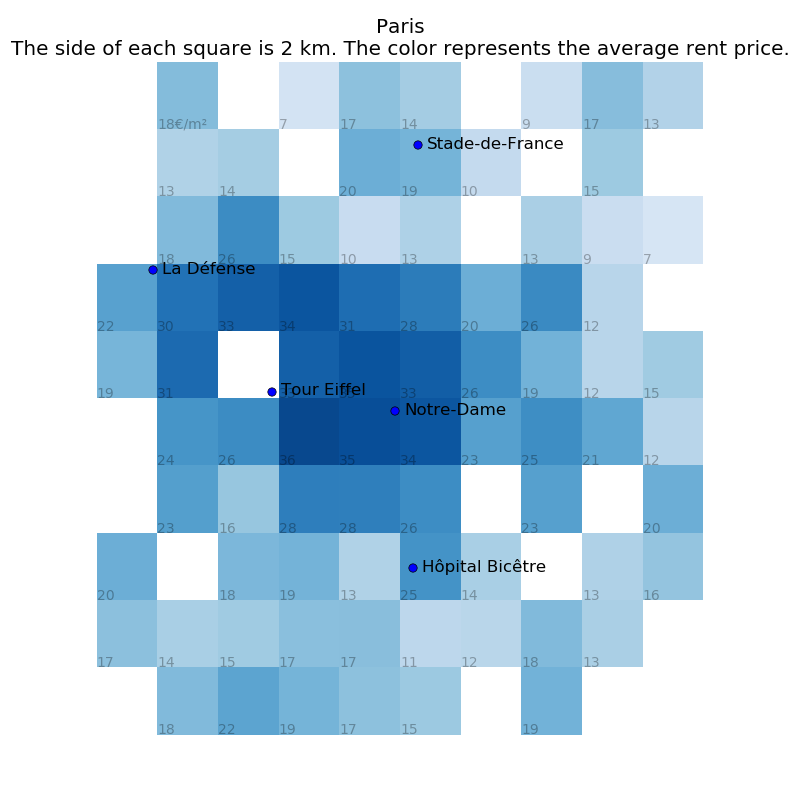
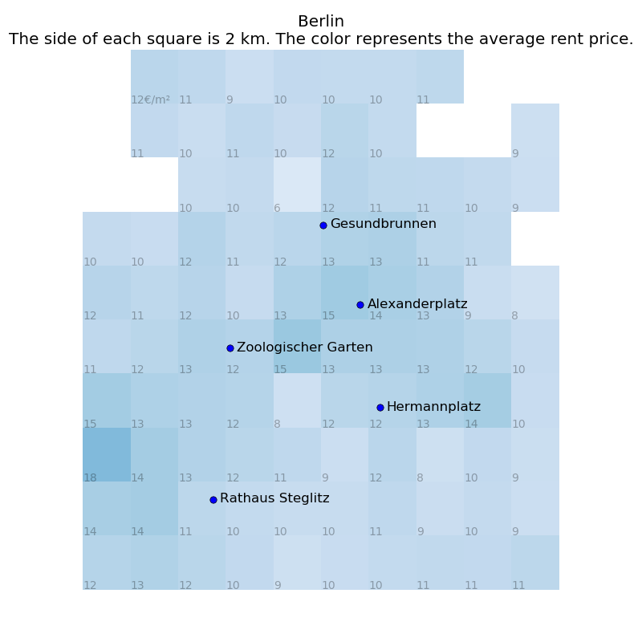

Paris is 4 times more unequal than Berlin. This is the result of a statistical analysis of the prices of 19,000 flats in both cities.

Paris is, by far, the richest city in continental Europe. That wealth is unequally spread is obvious. The two pictures below, for instance, were taken at just 5 kilometers of each other.

<small>Left: Avenue Hoche. Right: Cité des Agnettes.</small>

Measuring inequality within cities is hard. The richest people live in cities, meaning that any traditional measure of income inequality, like the Gini coefficient, will be very high in any city. Alternative approaches have been tried. In 2013, researchers at the MIT Medialab used Google Streetview to assess inequalities in New-York, Boston, Linz and Salzburg. They presented views from random addresses in these cities and measured the perception of safety of volunteers who looked through the pictures. Obviously, Boston and New-York were found more unequal than Austrian towns ([link to the paper](http://journals.plos.org/plosone/article?id=10.1371/journal.pone.0068400)).

Rents are a great measure of inequality. If a neighborhood is seen as especially undesirable, rents go down until tenants find renters desperate enough to live there. The lack of public transport, poor safety conditions and bad image all impact rent prices. We divided Paris and Berlin in 100 squares of 4 km² each and measured the average rent price in each, using the method we explained previously ([read post here](http://blog.rentswatch.com/finding-the-right-price-per-sqm/)). We discarded areas with less than 4 data points.

[The detailed results can be found here.](https://github.com/jplusplus/rentswatch-stats/blob/master/analyses/inequalities/table.csv)

The graphs show how unequal Paris is, compared to Berlin. In Paris, prices range from 7€ per square meter (between Drancy and Bobigny) to 36€ (near the Eiffel Tower). In Berlin, prices range from 6€ (Alt-Reinickendorf) to 18€ (in the Grunewald forest, with only 4 data points).

By any measure of inequality (range, range ratio, coefficient of variation), Paris comes out on top. If you have ideas as to which measure of inequality would be best for the topic at hand, do get in touch!

Some argue that Paris cannot be compared to its _banlieue_. Paris is officially a city in its own right and should be treated as such, they say. We disagree. A city is a contiguous built-up area where people live and work. Paris within city limits does not fit this definition, as many people who work in Paris do not live there. Looking only at Paris-the-city makes any analysis totally useless. It would be akin to analyzing London-Westminster or Berlin-Mitte without the rest of their cities. Just because the French government did not change the city limits as the city expanded (as Berlin did in 1920 and London in 1965) does not mean that we need to use outdated concepts to describe reality.

### Limits

We had to take 4-km² squares because our Parisian data is not fine for any closer analysis. It could be that inequalities are strong within each 4-km² square. However, having the same methodology for both cities makes sure that the comparison itself holds.

## Want to see the data for your city?

Rentswatch aims at fostering quality journalism on the housing crisis. We are looking for exclusive media partners in Europe to explore the data with us. Contact us at contact@rentswatch.com 