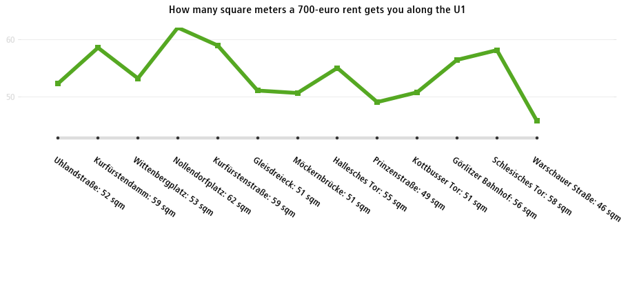
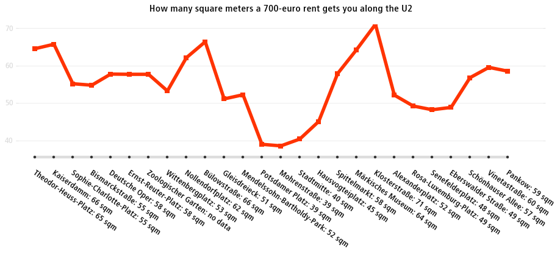
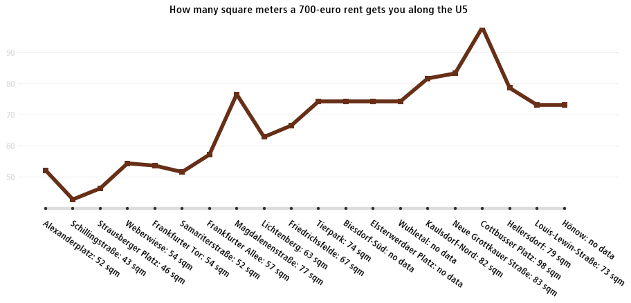
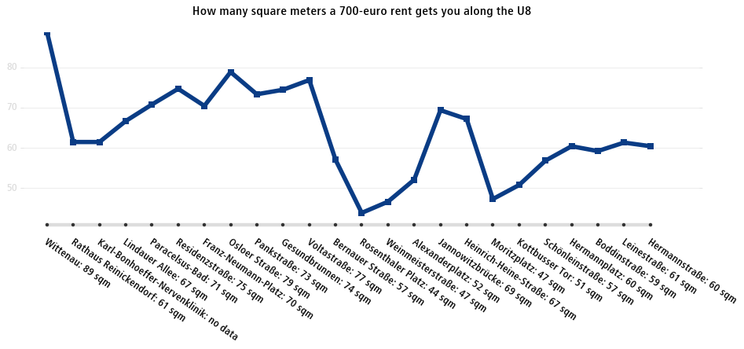

Official bodies use administrative boundaries when reporting data. Normal people do not. Normal people use items from everyday life to apprehend the world. When it comes to urban geography, the most common landmark normal people use are metro (subway) stations. Media outlets such as the Berliner Morgenpost ([M29 - Berlins Buslinie der großen Unterschiede](http://interaktiv.morgenpost.de/m29/)) or The Thrillist ([The Manhattan Subway Rent Map: Where You Can't Afford to Live, by Stop](https://www.thrillist.com/entertainment/new-york/manhattan-subway-rent-map)) used this technique.

In Berlin, where data is abundant enough, Rentswatch let us estimate the price of rents within 500 meters of every metro station. We ran our script for the lines U1, U2, U5 and U8. The lines represent the area size you can rent, on average, for a (warm) rent of 700€ per month.

[The detailed results can be found here.](https://github.com/jplusplus/rentswatch-stats/blob/master/analyses/u_bahn_linien/table.csv)

## Want to see the data for your city?

Rentswatch aims at fostering quality journalism on the housing crisis. We are looking for exclusive media partners in Europe to explore the data with us. Contact us at contact@rentswatch.com 