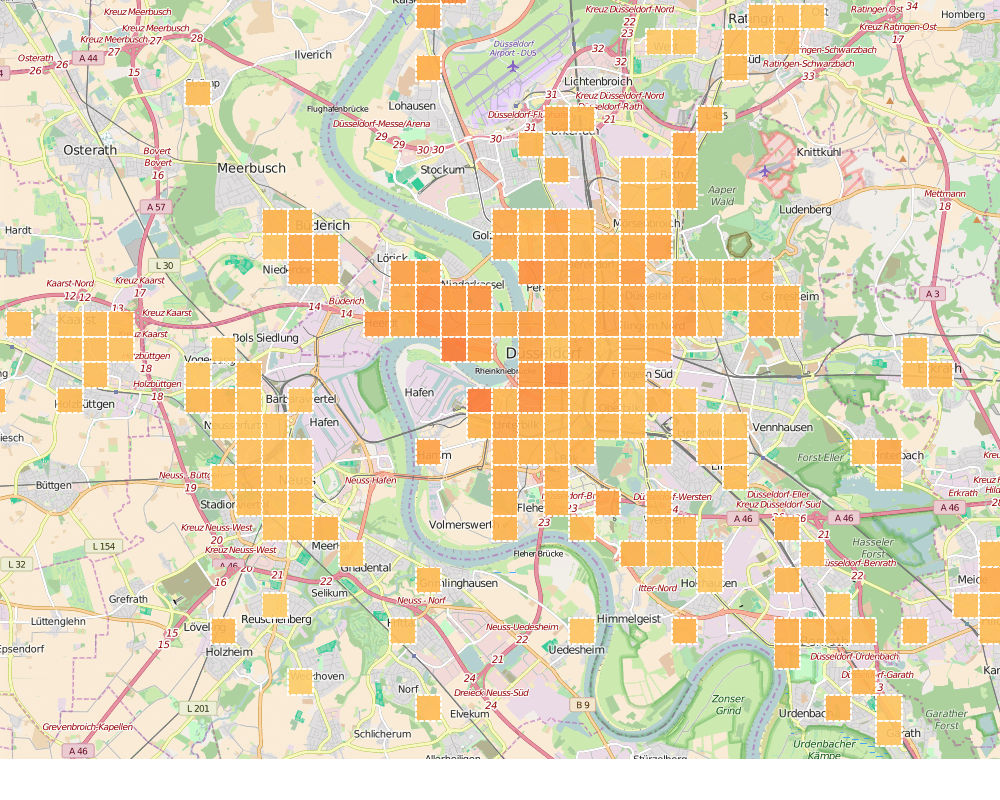
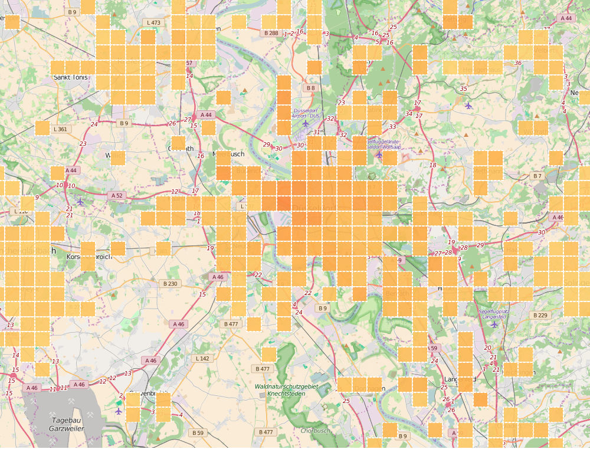
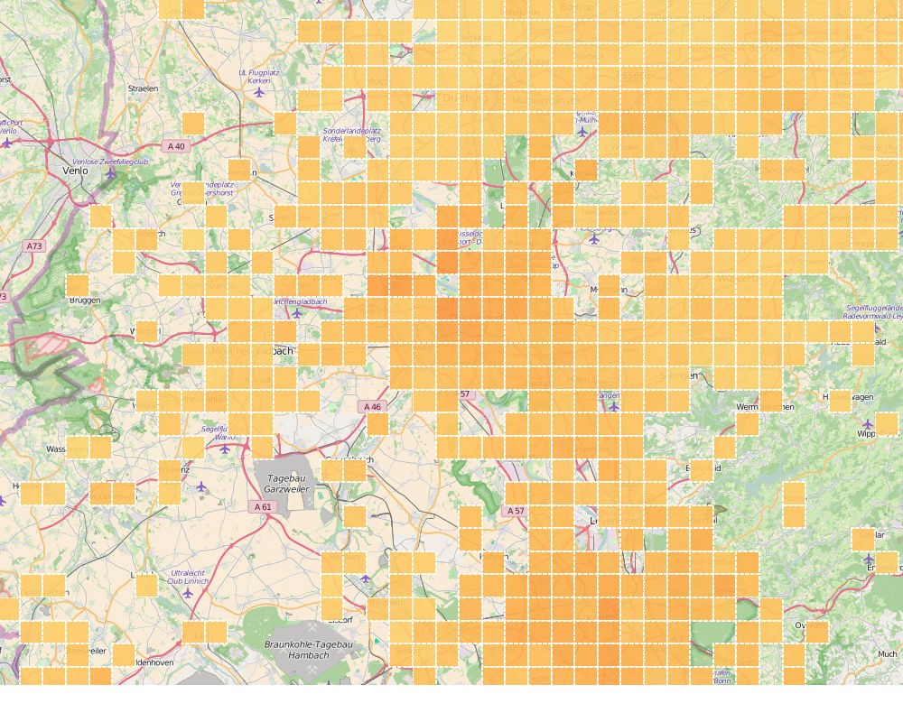
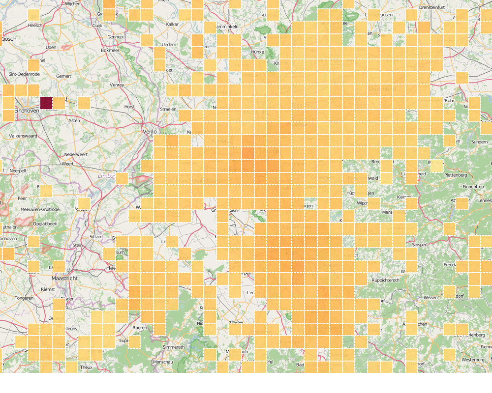
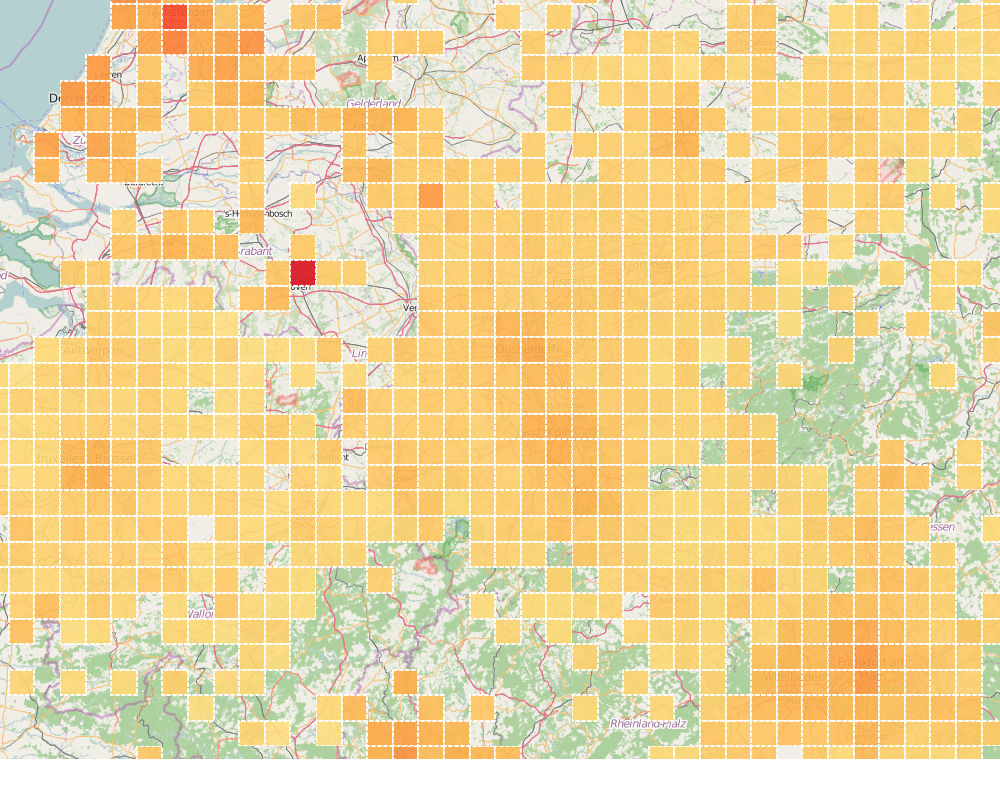
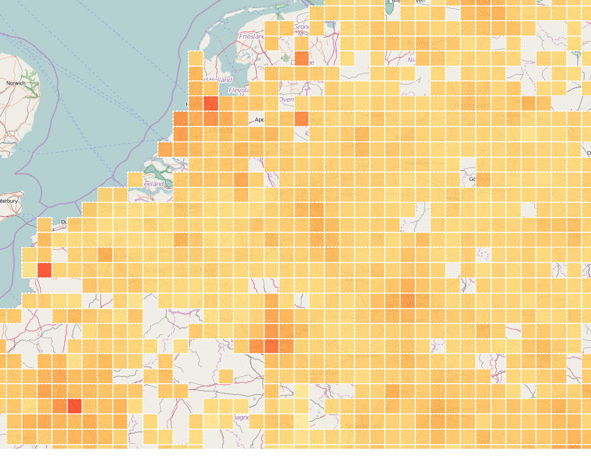
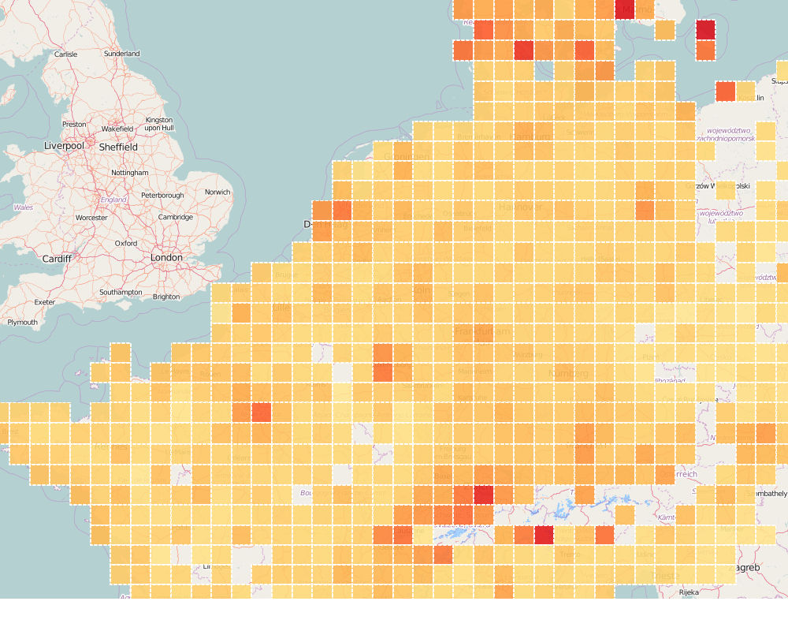
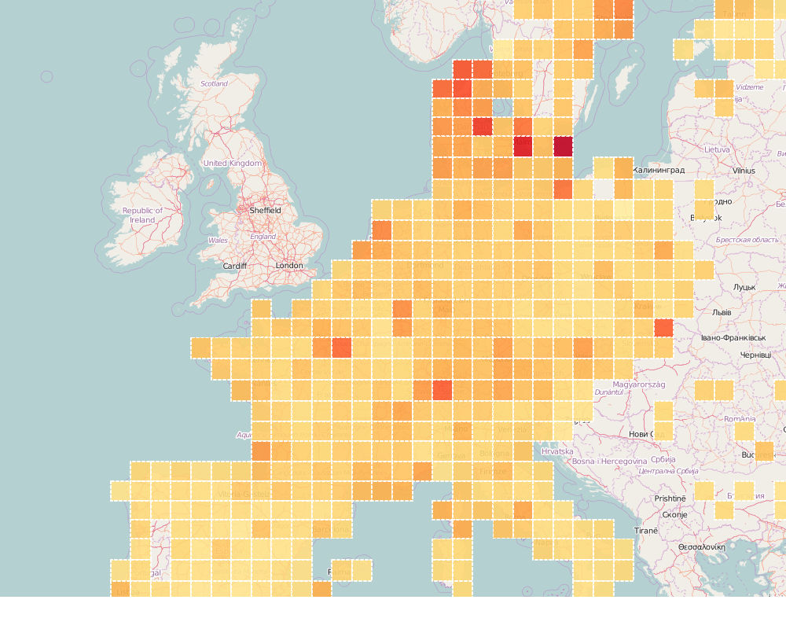
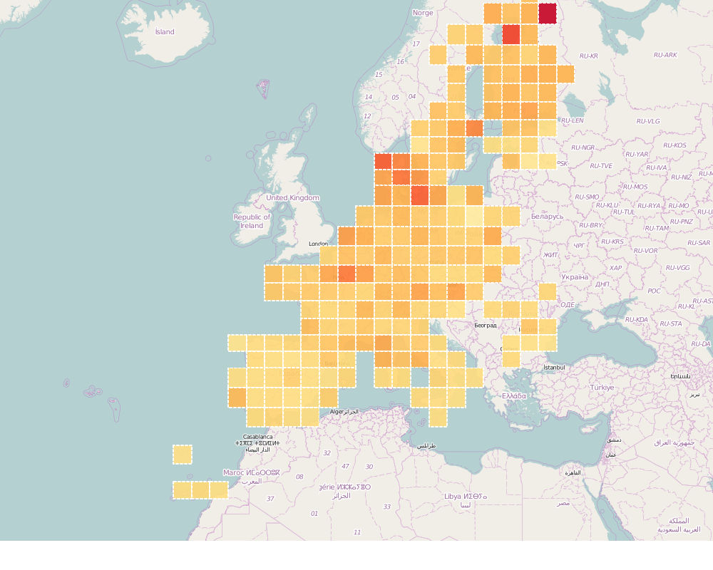

We build Rentswatch to visualize rent prices across borders easily. To do so, we needed to make a map. Several free and easy-to-use tools exist to map data, such as CartoDB and Google Fusion Tables. But they won't let you map several hundred thousand data points fast. We had to find something else.

Inspired by the examples from Comeetie, who mapped revenue in France block by block, and by the Berliner Morgenpost, which mapped the demographic evolution of each city in Europe, we decided to make our own tiles. The maps you see online are mainly a large collection of square images - _tiles_ - stiched together. For each zoom level, the globe is divided in a number of tiles that have a position on a large grid. At higher zoom levels, the globe is divided in few tiles. The more you zoom, the more tiles you need to cover the globe. This, for instance, is tile number 2125/1367 for zoom level 12, which shows a part of Düsseldorf:

We decided to overlay tiles that contain rent prices for each square of 500m x 500m, all across Europe. Instead of having an image of the rent prices, we We just had to make a computer program that could generate the thousand of tiles that we needed.

We told the computer to go from the tile at the North-West corner of Europe all the way to the tile at the South-East and to compute the average rent along the way. The code looked something like this:
	
	# Loops through all zoom levels
	for zoom_level in range(4,13):

		# Computes all tiles for the whole world
		for X in range (0, int(math.pow(2, zoom_level))):
			for Y in range (0, int(math.pow(2, zoom_level))):
				
				# Finds the bounds of each tile
				N_tile, W_tile = num2deg(X, Y, zoom_level)
				S_tile, E_tile = num2deg(X + 1, Y + 1, zoom_level)

				#Are we in Europe?
				if N_tile < N_max and S_tile > S_max and E_tile < E_max and W_tile > W_max:

					# Makes the tile...

The complete code [is available on Github](https://github.com/jplusplus/rentswatch-stats/blob/master/analyses/tiles/make_tiles.py).

This approach works well for zoom levels where there are few tiles. However, at lower zoom levels, where you need thousands and thousands of tiles to cover Europe, the operation would take days on an average computer. -Because we cannot rent a supercomputer- Because we strive to be more efficient, we had to devise a better method. Instead of computing rents for all of Europe linearily, including the vast swathes of territory for which we have no data (e.g. the sea), we decided to start from the 600 cities where we had more than 100 data points. For each city, the computer creates the neighboring tiles. The logic looks like this:

	# Loops through all zoom levels
	for zoom_level in range(4,13):

		#Loops through all cities
		for city in cities:

			#Finds out which tile the city is in
			X_city, Y_city = deg2num(city_lat, city_lng, zoom_level)
			
			# Computes the 16 tiles around the city
			for X in range(X_city - 2, X_city + 2):
				for Y in range (Y_city - 2, Y_city + 2):

					# Makes the tile...

The complete code [is available on Github](https://github.com/jplusplus/rentswatch-stats/blob/master/analyses/tiles/city_make_tiles.py).

This way, it takes just a few hours to create the tiles for almost all the places in Europe for which we have information on rents.

The result is a slippy map of Europe where the color of each square represents the average renting price. The more red the square, the higher the rents. The map will be live when we launch, in May 2016. Let's zoom in on Düsseldorf, for instance. You can see the gap between Oberkassel, Carstadt and the rest of the city. But when you zoom out, you can clearly see that this divide is nothing compared to the divide between Germany and Switzerland, for instance.

