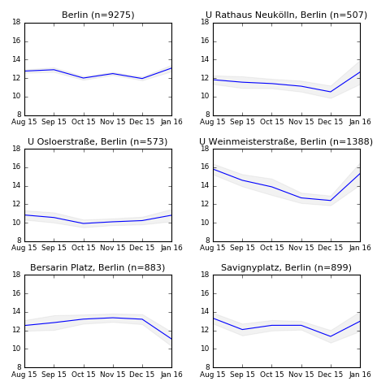
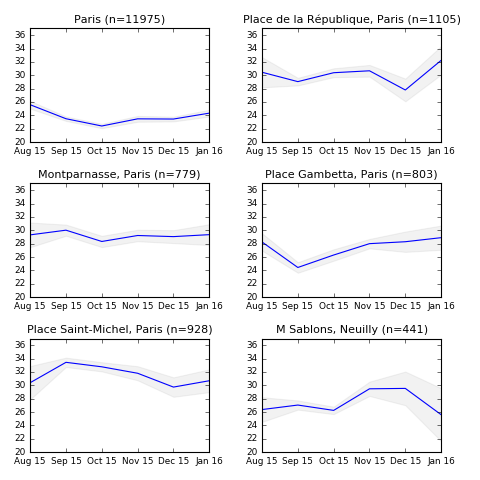

Rentswatch is a long-term project that tracks how rents change over time. We started data collection in August 2015 and can now analyze 6 months' worth of data.

6 months is not enough to track any serious increase in rent prices, but some interesting trends already emerge. In many of the most sought-after areas in Paris and Berlin (Neukölln, Weinmeisterstraße, Savignyplatz, République, Saint-Michel), **prices seem to slide in the autumn and hit bottom in December** before rebounding in January. Notice as well that some neighborhoods follow opposite trajectories.

Beware that prices do not fall in December. Real estate agencies simply offer more expensive flats in January, probably because they know that richer folks are too busy preparing Christmas in December to move in a new flat.

There are other reasons that could explain the December fall in prices. In Paris, for instance, the tenant who rents the flat _on January 1st_ has to pay a hefty local tax. It might be cheaper to pay a slightly higher rent from January onwards while avoiding to pay the dreaded tax.

The average price per square meter is the blue line. The gray area shows the margin of error. For Paris and Berlin, we looked at properties within a 10-kilometer radius of the city center. For other locations, the radius is 2 kilometers.

## Berlin

## Paris

[The source code for these visualizations is available on GitHub](https://github.com/jplusplus/rentswatch-stats/blob/master/analyses/evolution/evolution.py).

## Want to see the data for your city?

Rentswatch aims at fostering quality journalism on the housing crisis. We are looking for exclusive media partners in Europe to explore the data with us. Contact us at contact@rentswatch.com 