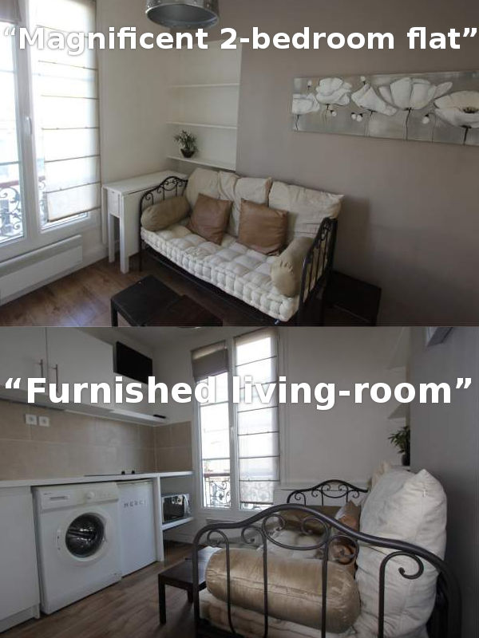
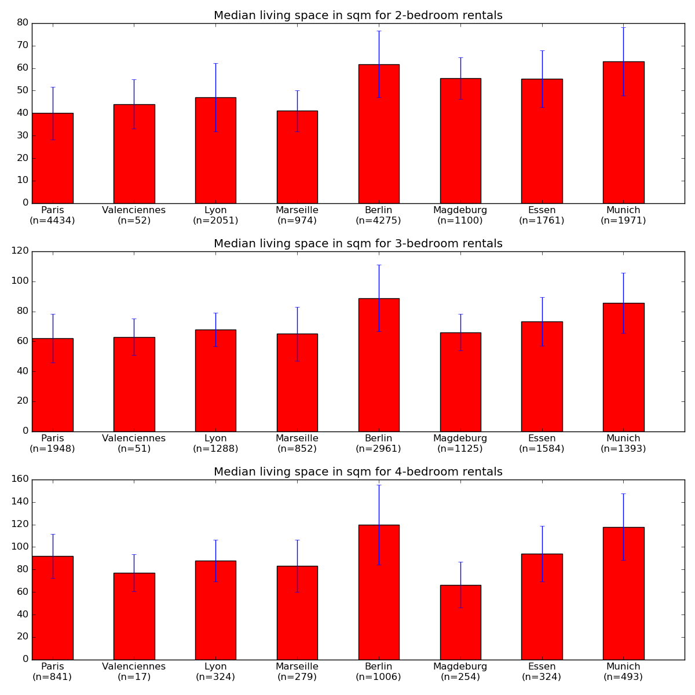
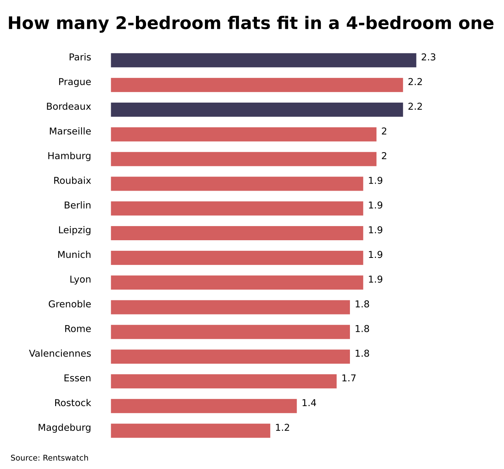

It's not cheap to live in the cool 11th arrondissement of Paris. But for just over 900€ per month (excluding electricity), a young couple can rent a 2-bedroom flat. A 22-square-meter 2-bedroom flat, that is. In this “magnificent” object (quotes are from the realtor), the “furnished living room” doubles as a kitchen. The good thing is that you can operate the microwave while sitting on the couch. The bad thing is that you might break the microwave if you try to stretch out your legs while sitting on the couch.

Not only are flats expensive, they can also be desperatly small. Out of 16 cities we analyzed, Paris had the smallest median size for 2-bedroom flats: 40 square meters. Largest flats were in Berlin and Munich. 8 cities are charted below with the standard deviation shown in blue.

As always on Rentswatch, we analyze cities not by looking at administrative boundaries but by drawing a 10-km-radius circle around the city center.

## It's not about wealth

The size of a 2-bedroom flat has nothing to do with wealth. Munich and Paris are both extremely rich cities, but their housing market is totally different. A 2-bedroom flat in Munich typically offers 63 square meters. On the contrary, Magdeburg is one of Germany's poorest cities. Average revenue per person in Magdeburg is about [16,000€ per year](http://www.stala.sachsen-anhalt.de/Internet/Home/Veroeffentlichungen/Pressemitteilungen/2013/11/93.html). In Ile-de-France, the region around Paris, the median income is over [23,000€](http://www.insee.fr/fr/themes/document.asp?reg_id=20&ref_id=20529). Despite this difference, flats are much bigger in Magdeburg than in Paris.

Flat size also has little to do with overcrowding. After all, Magdeburg lost close to 20% of its population since 1990. Maybe flats there are large because so many of them are empty? However, this explanation doesn't hold. In Paris, population density is above 5000 people per square kilometer, while it is barely over 1000 in Bordeaux, where 2-bedroom flats are equally small. In Munich, population density is relatively high (above 3000 persons per square kilometer) but flats are very spacious.

Look at the difference between the size of 2-bedroom flats and 4-bedroom ones. Here, Paris is in the first half of the rankings and Bordeaux is not far behind. In other words, in these cities, poor people rent horribly small flats but rich people rent fairly spacious ones.

## It's about inequality

This chart shows how many typical 2-bedroom flats fit in a typical 4-bedroom flat in different cities.

In cities at the bottom of the graph, like Magdeburg or Rostock, there is very little demand for large 4-bedroom flats. This explains why the difference in size between 2- and 4-bedroom flats is so small. In Munich and Berlin, demand for large and small flats balance out for all types of flats, which explains why a typical 4-bedroom flat is about twice as big as a typical 2-bedroom one. In Paris, Prague and Bordeaux, there is a lot of demand for small 2-bedroom flats but little demand for small 4-bedroom ones. There, many relatively poor people need small 2-bedroom flats but much fewer relatively poor ones need 4-bedroom ones. In other words, **the graph above is a visualization of inequality by city**.

It might be that families move out of the city when they need more space or that there is much less market activity for small 4-bedroom flats (because people hold on to the flats once they have them). Whatever the reason, it shows that it's harder to find a relatively cheap and relatively large flat in Paris, Prague and Bordeaux.

Such inequality is not visible when looking at income alone. In Paris, you need to be rich (by European standards) even to rent a microflat. The typical 2-bedroom flat in Paris costs 1,100€ to rent, which is more expensive than a 4-bedroom flat everywhere else except for Berlin and Munich.

## Want to see the data for your city?

Rentswatch aims at fostering quality journalism on the housing crisis. We are looking for exclusive media partners in Europe to explore the data with us. Contact us at contact@rentswatch.com 