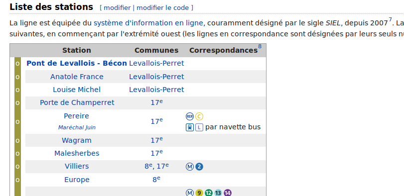
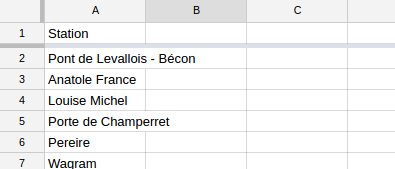
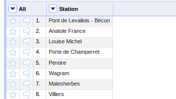
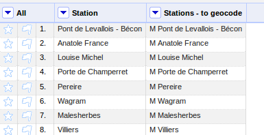
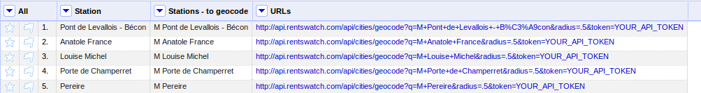
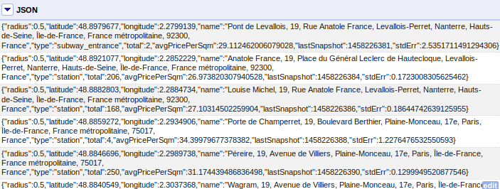
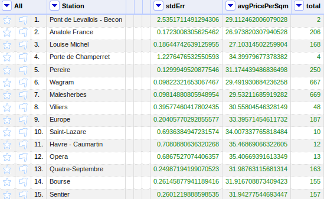
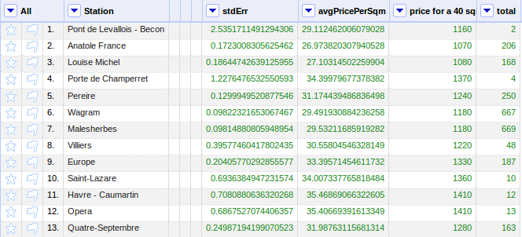
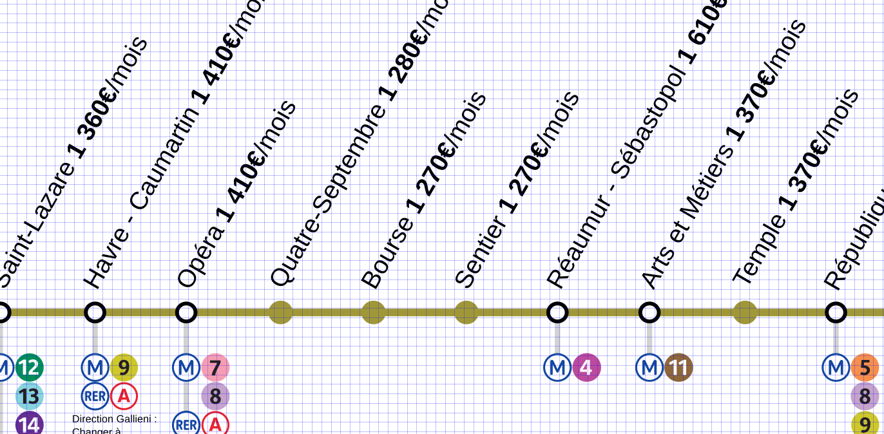

Over the past few weeks, we built a simple API to make accessing Rentswatch data much easier.

The API is documented at [api.rentswatch.com](http://api.rentswatch.com). While we encourage you to read the docs and try things out, let's take an example and do one of these very popular rents-along-the-subway maps ([see here for the map of Munich](http://blog.immobilienscout24.de/content/uploads/2016/01/Miet_Map_Muenchen_final.jpg)).

## Making a map of rents across the subway

We'll map the average rents along the subway line 3 in Paris.

#### Finding the stations list

Over at Wikipedia, they have a [list of stations](https://fr.wikipedia.org/wiki/Ligne_3_du_m%C3%A9tro_de_Paris).

This list of stations can be structured in a table easily with the IMPORTHTML() function of Google Spreadsheets. After a bit of cleaning, the list can be exported as a CSV.

#### Fetch data from the API in OpenRefine

Let's import the list in OpenRefine, which we'll use to ping the API and get the rents data.

The Rentswatch API can return the average rents prices for any location in Europe. The location is geocoded using the Nominatim service of OpenStreetMaps (OSM), so that locations must be understood by OSM to be geocoded. Subway stations are present in OSM but require a certain format. In Paris, the capital letter M must be prefixed to the station name. First, let's create a new column with the names to be geocoded.

Now is the important part. We'll create the URLs that we will ping. We'll use the "geocode" method of the API. It requires an address and a radius and gives the average rent price for all flats within this radius. Obviously, you'll have to replace YOUR_API_TOKEN by, well, your API token.

OpenRefine can now go and ping all these URLs to find the average price along the line. The API returns a bunch of JSON data.

Let's parse this data to get the average price for each station.

#### Make it legible

And let's multiply the average price per square meter by 40 to have the average price for a 40-square-meter flat, which is more ligible for users.

Now open an image processing software and have fun!

## Want to get an API key?

Rentswatch aims at fostering quality journalism on the housing crisis. We are looking for exclusive media partners in Europe to explore the data with us. Contact us at contact@rentswatch.com 