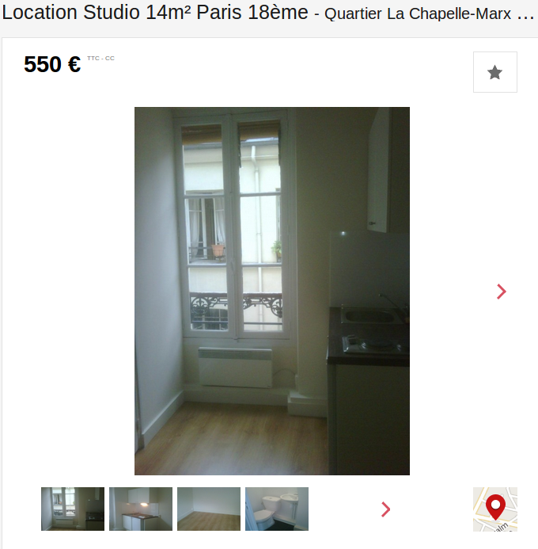

Depuis 1er août 2015 à Paris, les propriétaires ne peuvent plus exiger un loyer supérieur au loyer de référence, équivalent à un loyer médian majoré de 20%. Ce loyer de référence est calculé par l’observatoire des loyers de l’agglomération parisienne (OLAP) en fonction du type de logement, son année de construction, le quartier etc.

Bémol : personne ne contrôle que le loyer de référence soit effectivement appliqué par les bailleurs. C’est uniquement au locataire de contester le montant de son loyer une fois le bail signé si celui-ci se trouve être plus élevé. 

## Contester son loyer : pas si évident pour le locataire

Le locataire peut ainsi demander une baisse du prix de son loyer après la signature du bail si son montant est supérieur au loyer maximum pour ce type de bien. Au cas où le bailleur refuse la demande du locataire, ce dernier peut engager une procédure de conciliation auprès de la commission de conciliation, composée à part égale de représentants de bailleurs et de locataires et chargée de trouver une solution à l’amiable, ou saisir le tribunal d’instance, qui gère les litiges civils. 

Mais la peur de perdre son logement, particulièrement dans le contexte tendu du marché locatif parisien, retient les actions des locataires. Ainsi, selon l’<a href="http://www.adil75.org//sites/default/files/upload/etudes/2016.07_encadrement_des_loyers_adil75.pdf" target="_blank">Agence départementale d’information sur le logement de Paris</a> de “nombreux locataires” renoncent à faire appel à la commission de conciliation afin de “conserver de bonnes relations avec leur bailleur”. Certains évoquent également la peur de de se faire expulser en cas de recours.

## Les propriétaires ne jouent pas toujours le jeu

Au 30 juin 2016, soit près d'un an après la mise en place du dispositif d'encadrement des loyers, seulement 80 procédures de conciliation ont été engagées par des locataires, dont 46 concernant le niveaux des loyers. Pourtant, une recherche rapide sur les sites de location d’appartement permet de constater plusieurs dépassements du prix maximum :

Cet <a href="https://archive.fo/IxTIH" target="_blank">atelier d’artiste</a> dans le 20ème par exemple, transformé en studio de 19m2, ne devrait pas être loué plus de 665 euros, mais est disponible au prix de 715 euros hors charges, soit une perte de 612 euros par an pour le locataire. 

Autre exemple, ce <a href="https://archive.fo/clSaP" target="_blank">studio</a> de 14m2 dans le 18ème loué 550 euros, loin des 430 euros maximum prévu pour la zone. 

<i>source : [seloger.com](https://archive.fo/IxTIH)</i>

Le loyer maximum est néanmoins respecté par certains bailleurs, comme pour ce <a href="https://archive.fo/siwpA" target="_blank">deux pièces</a> dans le 11ème, loué 922 euros soit 200 euros de moins que le loyer de référence.

## Le “complément de loyer”, un moyen pour les propriétaires de contourner l’encadrement des loyers ?

Les 34 autres recours portent sur le complément de loyer, également prévu dans le dispositif d’encadrement des loyers. Le complément de loyer est un montant arbitraire que le bailleur peut ajouter au loyer maximum si il estime que son bien dispose de “<a href="https://www.legifrance.gouv.fr/affichTexteArticle.do;jsessionid=DC745D686B12601C7B57B8EB84BA1B4C.tpdila20v_1?idArticle=JORFARTI000030711560&cidTexte=JORFTEXT000030711540&dateTexte=29990101&categorieLien=id" target="_blank">caractéristiques de localisation ou de confort d'un logement</a> particulières. Il peut s'agir aussi bien d'un toit terrasse ou d'un jacuzzi que d'une machine à laver... Le problème est qu'aucune liste précise ne décrit les éléments qui pourraient justifier ce complément de loyer ni son montant.

Une cheminée ornementale ou un balcon peuvent-il être considéré comme des caractéristiques de confort du logement ? La marge d’interprétation très large de ce complément de loyer fait qu’il sera défini par la jurisprudence. Mais si le locataire, loin d’être en position de force sur le marché parisien, ne saisit pas le tribunal d’instance, la notion restera floue en impactant encore une fois les locataires.

Le complément de loyer n’est en outre que contestable dans les trois mois suivant la signature du bail, contrairement au loyer qui peut faire l’objet d’un recours dans les trois ans. 