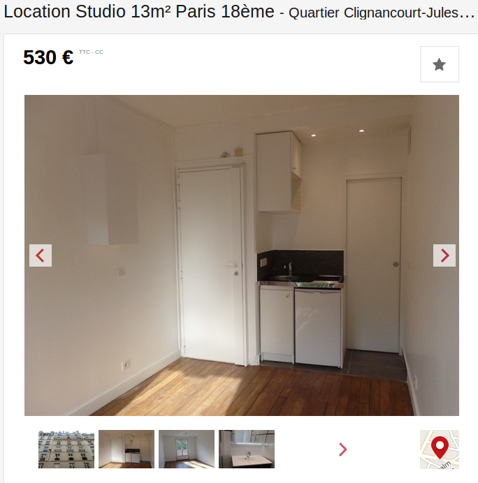

Loyers prohibitifs, dossiers interminables, files d’attente pour les visites, lettres de motivation pour les propriétaires, racisme et discrimination… Trouver un logement à Paris s’apparente à une quête du Saint Graal contemporaine, à l’issue plus proche de Sacré Graal des Monthy Python que d’une épopée chevaleresque.

<iframe src="//giphy.com/embed/HfJdu4HABDU3e" width="480" height="298" frameBorder="0" class="giphy-embed" allowFullScreen></iframe>
<a href="https://giphy.com/gifs/movie-funny-HfJdu4HABDU3e">via GIPHY</a>

Malgré la mise en place du dispositif d'encadrement des loyers en août 2015 à Paris, il faut encore compter entre 1000 et 1450 euros hors charges pour un 40m2. Les loyers les moins élevés se trouvent dans l'est parisien mais restent loin d'être accessibles : 25 euros hors charges au m2 dans le 19ème arrondissement, le prix le moins élevé à Paris intra-muros. 

## Une situation qui en laisse beaucoup sur le carreau

Avec un <a href="http://www.insee.fr/fr/themes/document.asp?reg_id=20&ref_id=20529&page=alapage/alap414/alap414_tab.htm#tab3" target="_blank">revenu médian</a> de 1800 euros en Île-de-France et de 2050 euros à Paris, peu de ménages gagnent l'équivalent net de trois fois le montant du loyer, minimum requis pour accéder à un logement. 

<iframe width="100%" height="520" frameborder="0" src="https://paddymonsun.carto.com/viz/3dceccc2-6f80-11e6-8a27-0e233c30368f/embed_map" allowfullscreen webkitallowfullscreen mozallowfullscreen oallowfullscreen msallowfullscreen></iframe>

Trouver un premier logement pour les jeunes diplômés est d’autant plus complexe. La <a href="http://dares.travail-emploi.gouv.fr/dares-etudes-et-statistiques/etudes-et-syntheses/dares-analyses-dares-indicateurs-dares-resultats/article/hausse-soutenue-du-taux-d-entree-en-cdd-dans-les-mouvements-de-main-d-oeuvre-au" target="_blank">part des CDD à l’embauche</a>, contrats souvent rédhibitoires dans un dossier de location, atteint 84.2%. Le salaire médian pour un BAC+5 est de <a href="https://presse.apec.fr/Presse/Communiques-de-l-Apec/Les-Etudes/jeunes-diplomes-2015" target="_blank">25 700 euros brut</a> à l’embauche, soit 1649 euros net mensuel, loin encore du salaire requis pour louer un logement décent à Paris. 

## Un studio de 13m² pour un jeune actif

Un jeune actif peut donc espérer vivre dans un studio de 13m2 dans le 18ème, avec toilettes séparées en prime pour 510 euros hors charges. Loyer qui devrait être de 400 euros hors charges suite à la mise en place du dispositif d’encadrement des loyers.

<i>source : [seloger.com](https://archive.fo/E2eKP)</i>

Même à deux et en CDI, accéder à l'indépendance est un tour de force :

“<i>Nous on avait un dossier ultra-favorable, et on a quand même été refusés pour des apparts sans raison alors qu'on a 2 salaires très confortables, et en CDI.</i>” <i>Raconte Léo, 27 ans. “On a un peu la situation à la con où on cherche les mêmes choses que des couples de 35/40 ans qui gagnent souvent plus. Mais au final, on a été chanceux parce que ça a été vite, j'ai des collègues qui ont fait 5 visites par semaine pendant 2 mois et qui n’ont toujours pas trouvé.</i>”

Bien que le prix des loyers soit souvent deux fois moins élevé en dehors de la capitale, la concentration de l'activité y est telle (14% des emplois en métropole en 2011) qu'il est souvent impossible d'envisager un déménagement hors de Paris, sans même évoquer l’importance de l’attachement à une ville ou un quartier. Il reste donc encore du chemin à parcourir avant que le dispositif d’encadrement des loyers fasse effectivement effet.